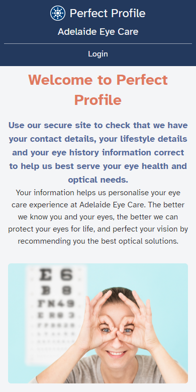
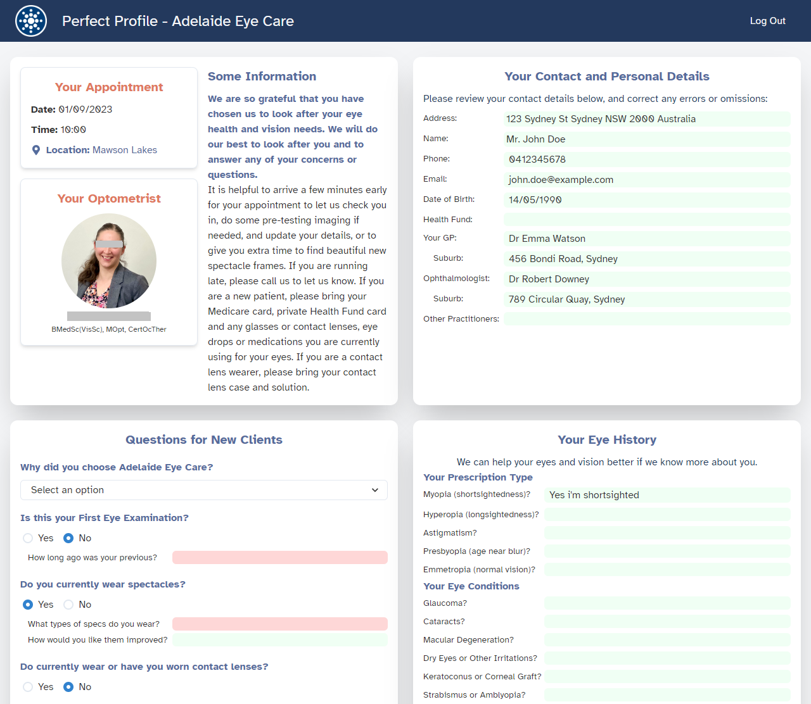
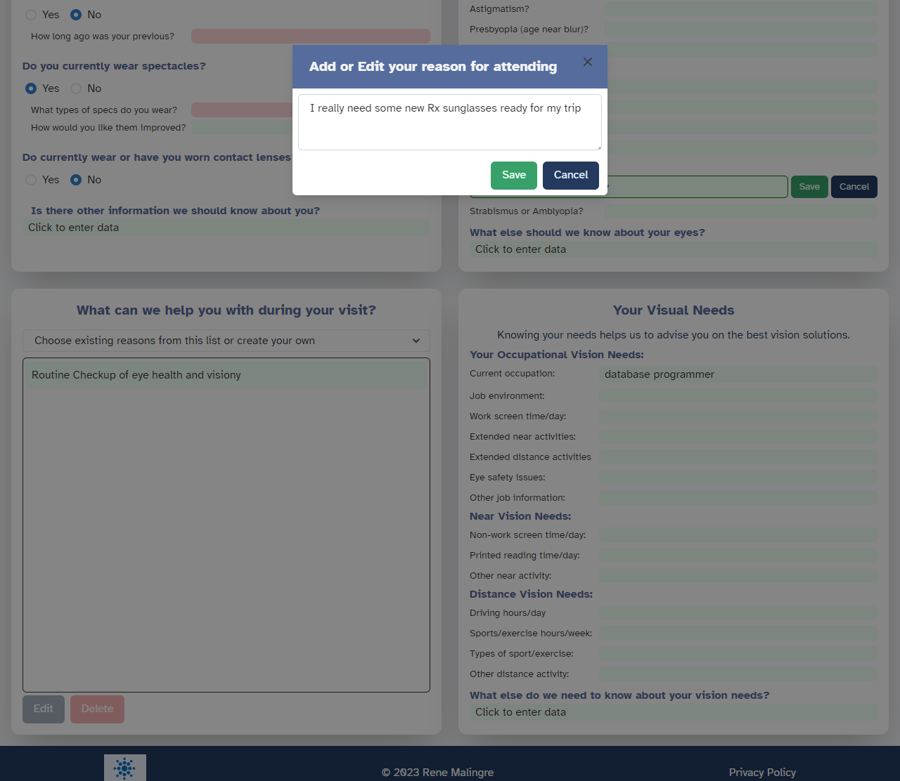

# Perfect Profile

 [](https://opensource.org/licenses/MIT)

A Client Profile data accuracy questionnaire for an optometry practice.

## Description

Perfect Profile is a progressive web application (PWA) built for clients to verify and update their contact details, lifestyle details, and eye history information, and to communicate their reasons for booking in for a consultation.

With a user-friendly interface, Perfect Profile aims to enhance the eye care experience for clients by ensuring all contact details and eye health information is up-to-date and accurate, allowing the optometrist to provide tailored eye health and optical solutions based on the information gathered.

It also aims to reduce the time spent in the waiting room and at the reception desk, as clients can complete the questionnaire privately at home, and to reduce the amount of paper used in the practice, and speed the flow of the clients through the practice.

It is built on the MERN stack, and uses Chakra UI for the front-end, and uses Apollo Server/graphql for communication.

## Table of Contents

- [Technologies Used](#technologies-used)
- [Installation](#installation)
- [Usage](#usage)
- [Live Application](#live-application)
- [Credits](#credits)
- [License](#license)
- [Contributing](#contributing)
- [Questions](#questions)

## Technologies Used

- [JavaScript](https://developer.mozilla.org/en-US/docs/Web/JavaScript) - Programming language
- [Node.js](https://nodejs.org/en/) - JavaScript runtime environment
- [Express.js](https://expressjs.com/) - Node.js web server application framework
- [React](https://reactjs.org/) - JavaScript library for building user interfaces
- [MongoDB](https://www.mongodb.com/) - NoSQL database
- [Mongoose](https://mongoosejs.com/) - MongoDB object modeling for Node.js
- [GraphQL](https://graphql.org/) - Query language for APIs
- [Apollo Server](https://www.apollographql.com/docs/apollo-server/) - GraphQL server
- [Apollo Client](https://www.apollographql.com/docs/react/) - GraphQL client
- [JWT](https://jwt.io/) - JSON Web Tokens for authentication
- [Bcrypt](https://www.npmjs.com/package/bcrypt) - Password hashing
- [Heroku](https://www.heroku.com/) - Hosting for the live application
- [MongoDB Atlas](https://www.mongodb.com/cloud/atlas) - Cloud database service
- [AWS S3](https://aws.amazon.com/s3/) - Cloud storage service
- [Chakra UI](https://chakra-ui.com/) - React component library

Custom React components were created for repeated use throughout the questionnaire.
React's 'useContext' hook was used to manage state throughout the application.
A custom React hook was created to retrieve user state information, rather than saving sensitive data on the client.

## Installation
  
Fork or copy the repository to your own machine. To install the necessary dependencies, run the following command in the terminal:
  
To install dependencies for the client and the server, run the following command in the terminal:

```bash
npm run install
```

To seed the database with sample data, run the following command in the terminal:

```bash
npm run seed
```

To build the application in the development environment, run the following command in the terminal:

```bash
npm run develop
```

To build the application in the production environment, run the following command in the terminal:

```bash
npm run build
```

Set up your local or remote mongoDB database environment and pass the connection string into environment variables. Set up your JWT_SECRET environment variable for creating the JWT tokens.

## Usage

Navigate to [http://localhost:3000](http://localhost:3000) or the [Live Application](#live-application) in your browser to view the application.

1. Visit the home page and familiarize yourself with the welcome section that details the app's purpose.
2. Existing users can click on the "Login" button to access their the login and then access their profile.
3. Once logged in, users can verify and update their contact details, lifestyle details, reason for visiting and eye history information.
4. New users are asked some more specific questions about their eye history and reason for choosing the practice.
5. Check the footer for the Privacy Policy.

Populating the database with user data and appointment and optometrist information is intended to be done directly from the Clinic's practice management software, inserting and extracting data directly from the database.

### Screenshots

Home screen on mobile:


Profile page on desktop:


Profile page on desktop continued:


## Live Application

The application is deployed on Heroku: [Perfect Profile](https://perfect-profile-d5a81bac6e60.herokuapp.com/).

## Credits

Thanks to the brilliant minds who created the libraries that made this application possible. See the links in the [Technologies Used](#technologies-used) section above.

A big thanks has to go to OpenAI's GPT-4 and GitHub's Copilot for dramatically speeding up the search for information vs a traditional search engine, and for quicker entry of code. I feel so fortunate to be doing this course at this time, when these tools have just become available.

A big thanks to my family and the staff at Adelaide Eye Care for their support and guidance throughout the course and the development of this application.

Thanks to Majdy and Lachlan and the staff at the University of Adelaide for their support and guidance throughout the course. I have learned so much, at a pace that is surprising, looking back. I am typically an autodidactic, but this bootcamp accelerated my learning enormously and allowed me to avoid so many pitfalls and technology dead ends.

## License
  
This repository is licensed under the [MIT](https://opensource.org/licenses/MIT) license.
  
## Contributing
  
Contributions to this project will not be accepted, as this project is an assessment piece for a coding course, and it must be the project author's own work. However, feel free to fork the repository and make your own changes.
  
## Questions
  
If you have any questions about the repository, open an issue or contact me directly at:
[rene.malingre@gmail.com](mailto:rene.malingre@gmail.com).
  
You can find more of my work at [GitHub](https://github.com/ReneMalingre).
